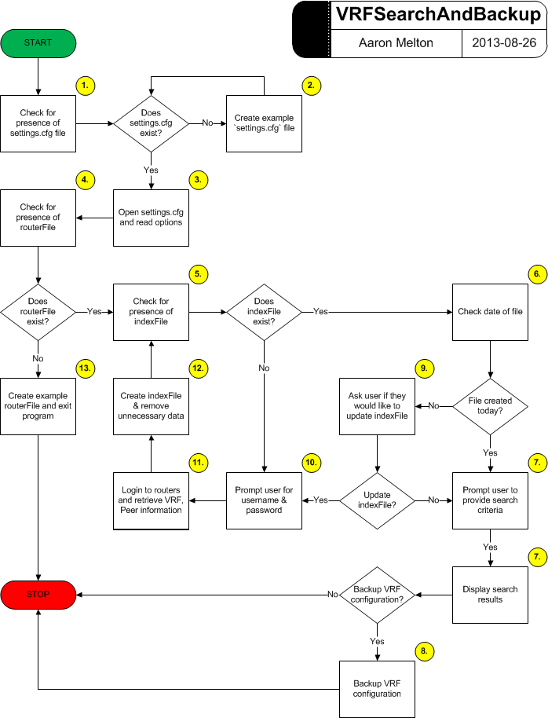

# VRFSearchAndBackup.py #
----------

## About ##
**VRFSearchAndBackup.py** is a Python application that allows a user to search
and back up the (VRF) VPN tunnel configuration on a Cisco router.

## Dependencies ##
Exscript module [https://github.com/knipknap/exscript/](https://github.com/knipknap/exscript/)

## Requirements ##
1. This application is hard-coded to use the SSH2 protocol; If SSH v2 is not
   enabled on your router(s), you will need to:
   * Add `ip ssh version 2` to your Cisco router(s) configuration and any 
   associated access-list changes.
   or
   * Alter the `default_protocol` variable in the `get_hosts_from_file` function
   to use a different protocol enabled on your router(s).
2. A valid username/password.
3. Presence of a `settings.cfg` file containing any pre-configured settings
   specified by the user.  Should this file not exist, the application will
   create it using default values.
3. Presence of a `routers.txt` file containing a list, one per line, of 
   Hostnames or IP Addresses of routers on which VRF tunnels are configured.
   (If one is not provided, the application will create an example file for
   the user.)
4. Presence of a `index.txt` file. The application will create this file for
   it's own use, if it does not already exist.

## Assumptions ##
1. This application was written for use on Cisco IOS devices and cannot be
   guaranteed to work on other makes/model routers.
2. This application assumes that you have enable privileges on each router
   in order to execute the `show running-config` command.  If you do not
   have sufficient user privileges, this application will not work as
   designed.

## Limitations ##
1. This application uses the same username/password to access ALL routers. If
   your routers use unique usernames/passwords, then this script will not work.

## Functionality ##

1. Upon execution, the application will search its parent directory for the
   presence of a file named `settings.cfg`.
   * If this file does not exist, the application will continue to Step 2.
   * If this file does exist, the application will proceed to Step 3.
2. The application will create a `settings.cfg` file with default values
   and continue to Step 3.
3. The application will open the `settings.cfg` file and read its default
   values into variables and continue to Step 4.
4. The application will search its parent directory for the presence of a file
   defined by the `routerFile` variable in `settings.cfg`.
   * If this file does exist, the application will continue to Step 5.
   * If this file does not exist, the application will proceed to Step 13.
5. The application will search its parent directory for the presence of a file
   defined by the `indexFile` variable in `settings.cfg`.
   * If this file does exist, the application will continue to Step 6.
   * If this file does not exist, the application will proceed to Step 10.
6. The application will check the timestamp of the last modification made to
   the indexFile.
   * If the file was created today, the application will continue to Step 7.
   * If the file was not created today, the application will proceed to Step 9.
7. The application will ask the user to provide the search criteria; Either
   the VRF name or Peer IP Address of the VPN tunnel to locate.  The application 
   will open the indexFile as read-only and search through the file.
   * If the search criteria was not found, exit program (END)
   * If the search criteria was found, display results and continue to Step 8.
8. The application will ask the user for their username and password, should
   these values not be pre-configured in the `settings.cfg` file and log into
   each router containing the search string.  Using the
   `show running-config | section <VRFName>` and 
   `show running-config | section SMVPN <RouerDistinguisher>` commands, the
   application will backup the VRF configuration to a file in a directory
   specified in `settings.cfg`.  Should this filename already exist, the
   application will continue to append an integer to the end of the filename
   until it is no longer attmepting to overwrite an existing file.
9. The application will ask the user if they would like to update the indexFile.
   * If the user does not want to update the indexFile, the application will 
   proceed to Step 7.
   * If the user wants to update the indexFile, the application will continue 
   to Step 10.
10. The application will ask the user for their username and password, should
    these values not be pre-configured in the `settings.cfg` file.  These
    credentials will be used to login to each of the routers listed in the 
    routerFile.  Continue to Step 11.
11. The application will log in to each of the routers listed in the routerFile
    using the username and password provided by the user, should these values
	not be pre-configured in the `settings.cfg` file. Using the 
	`show run | include crypto keyring` command, the application will collect 
	all the VRFs configured on each router and write them to indexFileTmp.  
	Continue to Step 12
12. Removing all the unnecessary information from indexFileTmp, the application
    will copy the VRF Name, Customer Peer IP and Local Peer IP (separated by 
	commas) into indexFile.  The application will then remove the temporary file,
	indexFileTmp.  Return to Step 5.
    Note: If indexFile already exists, it will be overwritten during this step.
13. The application will display instructions for the use of the routerFile.  
	The application will also create an example file and place it in its parent
	directory end exit (END).
